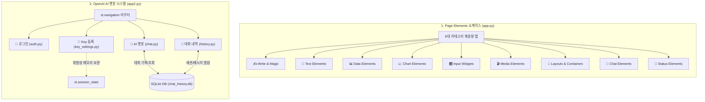
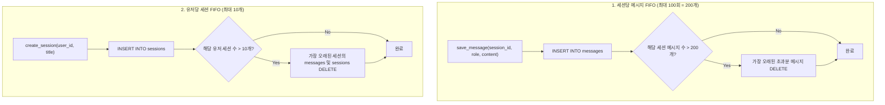

# 📑 Streamlit Basic 프로젝트 기능 명세서 (Functional Specification)

본 문서는 `streamlit-basic` 프로젝트에 구현된 두 가지 주요 시스템(**Streamlit Page Elements 쇼케이스** 및 **OpenAI AI 챗봇 시스템**)의 각 페이지별 상세 기능과 동작 규격을 기술한 기능 명세서입니다.

---

## 🏛️ 1. 시스템 아키텍처 개요



---

## 📱 2. 시스템 1: Streamlit Page Elements 쇼케이스 (`app.py`)

Streamlit 공식 문서의 `PAGE ELEMENTS` 9대 카테고리를 학습 및 탐색할 수 있도록 2단계 계층형 탭(최상위 탭 ➜ 서브 탭)으로 구성된 페이지입니다.

### 2.1. ✍️ Write and magic (`components/write_magic/`)
| 서브 탭 | 대상 API | 주요 기능 명세 |
| :--- | :--- | :--- |
| **st.write 기본 및 다양한 타입** | `st.write` | • 문자열, 마크다운, 다중 인자 출력<br>• 파이썬 딕셔너리 및 계층 구조 자동 서식화<br>• pandas DataFrame 전달 시 인터랙티브 테이블 자동 변환 |
| **스트리밍 & Magic 기능** | `st.write_stream`<br>Streamlit Magic | • 제너레이터를 통한 실시간 텍스트 타이핑 효과 렌더링<br>• `st.write()` 호출 없이 변수나 문자열 자체만으로 화면에 출력되는 Magic 문법 시연 |

### 2.2. 📝 Text elements (`components/texts/`)
| 서브 탭 | 대상 API | 주요 기능 명세 |
| :--- | :--- | :--- |
| **제목 및 캡션** | `st.title`, `st.header`<br>`st.subheader`, `st.text`<br>`st.caption`, `st.divider` | • 페이지 대/중/소 제목 계층 구조 표현<br>• 서식 없는 고정폭 일반 텍스트(`st.text`) 및 설명용 캡션(`st.caption`)<br>• 섹션 구분을 위한 가로선(`st.divider`) |
| **마크다운 & 컬러 서식** | `st.markdown` | • 굵게, 기울임, 취소선, 링크 등 기본 마크다운 문법<br>• Streamlit 고유 텍스트 컬러 태그(`:red[...]`, `:blue-background[...]`)<br>• 이모지 단축어(`:rocket:`, `:star:` 등) 렌더링 |
| **코드 및 LaTeX 수식** | `st.code`<br>`st.latex` | • 언어 지정(Python 등) 및 줄 번호(`line_numbers=True`)를 지원하는 구문 강조 코드 블록<br>• KaTeX 기반의 정밀한 수학 수식 렌더링 |

### 2.3. 📊 Data elements (`components/data/`)
| 서브 탭 | 대상 API | 주요 기능 명세 |
| :--- | :--- | :--- |
| **데이터프레임 & 에디터** | `st.dataframe`<br>`st.data_editor` | • 컬럼 정렬, 검색, 너비 맞춤(`width="stretch"`), 인덱스 숨김 지원 인터랙티브 테이블<br>• 브라우저에서 직접 셀 값을 더블클릭하여 수정하고 행을 동적으로 추가/삭제(`num_rows="dynamic"`)하는 스프레드시트 에디터 |
| **KPI 지표 & 테이블** | `st.metric`<br>`st.table` | • 주요 실적 지표(Value)와 전기 대비 증감(Delta) 및 색상 반전(`delta_color`) 표시<br>• 스크롤 없이 모든 셀이 고정 노출되는 정적 요약 테이블 |
| **JSON 트리 뷰** | `st.json` | • 계층형 JSON/딕셔너리 데이터를 접기/펼치기가 가능한 트리 뷰 형태로 시각화 |

### 2.4. 📈 Chart elements (`components/charts/`)
| 서브 탭 | 대상 API | 주요 기능 명세 |
| :--- | :--- | :--- |
| **선형 / 막대 / 영역 차트** | `st.line_chart`<br>`st.bar_chart`<br>`st.area_chart` | • DataFrame을 전달받아 설정 없이 자동 생성되는 꺾은선형 시계열 차트<br>• 카테고리별 비교 막대 차트<br>• 다중 지점 누적 추이를 보여주는 영역 차트 |
| **산점도 & 지도 (Map)** | `st.scatter_chart`<br>`st.map` | • 변수 간 상관관계 및 버블 크기(`size`)를 표현하는 산점도<br>• 위도(`latitude`)와 경도(`longitude`) 좌표 데이터를 지도 위에 핀 포인트로 시각화 |

### 2.5. 🎛️ Input widgets (`components/inputs/`)
| 서브 탭 | 대상 API | 주요 기능 명세 |
| :--- | :--- | :--- |
| **텍스트 입력** | `st.text_input`<br>`st.text_area` | • 기본값(`value`), 힌트 문구(`placeholder`), 도움말 툴팁(`help`)<br>• 비밀번호 마스킹(`type="password"`), 최대 글자 수 제한(`max_chars`)<br>• 라벨 숨김 모드(`label_visibility="visible"\|"hidden"\|"collapsed"`)<br>• 장문 입력용 높이 조절 텍스트 에어리어 |
| **숫자 & 슬라이더** | `st.number_input`<br>`st.slider`<br>`st.select_slider` | • 정수/실수 입력 및 증감 스텝(`step`), 포맷팅(`format="%.2f"`)<br>• 정수/실수 단일 슬라이더 및 구간 선택용 튜플 범위 슬라이더(`Range Slider`)<br>• 문자열 단계(만족도, 사이즈 등) 순차 선택 슬라이더 |
| **선택 위젯** | `st.radio`<br>`st.selectbox`<br>`st.multiselect`<br>`st.checkbox`<br>`st.toggle` | • 세로/가로형(`horizontal=True`) 및 캡션(`captions`) 지원 라디오 버튼<br>• 기본 선택 또는 빈 상태(`index=None`) 드롭다운<br>• 최대 개수 제한(`max_selections`) 지원 다중 태그 선택<br>• Boolean 체크박스 및 모던 스위치 토글 버튼 |
| **날짜/시간 & 기타** | `st.date_input`<br>`st.time_input`<br>`st.color_picker` | • 단일 예약일 및 기간 선택용 달력 튜플 범위 피커<br>• 단위 간격(`step=15분`) 지원 시간 피커<br>• HEX 색상 코드 및 팔레트 색상 선택기 |

### 2.6. 🎬 Media elements (`components/media/`)
| 서브 탭 | 대상 API | 주요 기능 명세 |
| :--- | :--- | :--- |
| **이미지 & 로고** | `st.image` | • 웹 URL 및 로컬 파일 이미지를 캡션 및 너비 맞춤(`width="stretch"`)으로 렌더링 |
| **오디오 & 비디오** | `st.audio`<br>`st.video` | • 사운드 파일 스트림/URL 재생 오디오 플레이어<br>• 유튜브 영상 및 mp4 동영상 임베드 비디오 플레이어 |

### 2.7. 📐 Layouts and containers (`components/layouts/`)
| 서브 탭 | 대상 API | 주요 기능 명세 |
| :--- | :--- | :--- |
| **컬럼 (Columns)** | `st.columns` | • 가로 균등 분할 및 가중 비율(`[3, 1]`) 분할<br>• 수직 정렬(`vertical_alignment="center"`) 및 간격(`gap="medium"`) 제어 |
| **컨테이너 & 여백** | `st.container`<br>`st.space`<br>`st.bottom` | • 카드 스타일 테두리(`border=True`) 그룹화<br>• 고정 높이 스크롤 박스(`height=130`)<br>• 요소 간 유연한 공간 추가(`size="large"`)<br>• 브라우저 최하단에 항상 고정되는 Footer 바닥글 컨테이너 |
| **아코디언 & 팝업** | `st.expander`<br>`st.popover`<br>`st.tabs` | • 접기/펼치기 및 초기 펼침(`expanded=True`), 아이콘 설정 아코디언<br>• 버튼 클릭 시 오버레이로 열리는 팝업 메뉴 컨테이너<br>• 컴포넌트 레벨의 중첩 탭 네비게이션 |
| **사이드바 & 플레이스홀더** | `st.sidebar`<br>`st.empty` | • 화면 좌측 패널에 위젯을 상시 배치하는 사이드바 제어<br>• 특정 위치의 콘텐츠를 동적으로 갱신하거나 비우는 단일 요소 플레이스홀더 |

### 2.8. 💬 Chat elements (`components/chat/`)
| 서브 탭 | 대상 API | 주요 기능 명세 |
| :--- | :--- | :--- |
| **챗 메시지 & 입력** | `st.chat_message`<br>`st.chat_input` | • 사용자(`user`) 및 어시스턴트(`assistant`) 대화 버블<br>• 커스텀 아바타(이모지 등) 적용<br>• 화면 하단 고정형 대화 입력창 |

### 2.9. 🔔 Status elements (`components/status/`)
| 서브 탭 | 대상 API | 주요 기능 명세 |
| :--- | :--- | :--- |
| **알림 메시지 (Alerts)** | `st.success`, `st.info`<br>`st.warning`, `st.error`<br>`st.exception` | • 성공(초록), 안내(파랑), 경고(노랑), 오류(빨강) 상태 알림 배너<br>• 예외 객체 및 스택트레이스 시각화 |
| **진행률 & 상태** | `st.spinner`<br>`st.progress`<br>`st.status` | • 비동기 작업 대기용 회전 로딩 스피너<br>• 퍼센트 단위(0~100%) 프로그레스 바<br>• 다단계 복합 작업의 실시간 진행 현황을 접기/펼치기로 안내하는 상태 컨테이너 |
| **토스트 & 이펙트** | `st.toast`<br>`st.balloons`<br>`st.snow` | • 우측 하단에 일시적으로 떴다 사라지는 토스트 팝업<br>• 축하 풍선 날리기 및 겨울 눈송이 내리기 시각 효과 |

---

## 🤖 3. 시스템 2: OpenAI AI 챗봇 시스템 (`app2.py`)

Streamlit 공식 멀티페이지 네비게이션(`st.navigation`)과 SQLite를 기반으로 유저 격리, 세션 메모리 보안, 대화 수명 주기(FIFO) 관리를 지원하는 프로덕션 레벨 챗봇 시스템입니다.

### 3.1. 라우터 및 글로벌 UI 스타일 (`app2.py`, `utils/ui_theme.py`)
- **밝은 계열 글래스모피즘 테마 (`utils/ui_theme.py`, `.streamlit/config.toml`)**:
  - 소프트 펄 화이트/스카이블루 그라데이션 파동의 밝은 배경화면(`assets/background.jpg`) 적용.
  - 다크 텍스트(`textColor="#0f172a"`)와 라이트 반투명 글래스 컨테이너(`rgba(255, 255, 255, 0.82)`)로 화사하고 가독성 높은 뷰포트 구현.
- **네비게이션 로고 브랜딩 (`st.logo`)**:
  - `st.logo("assets/logo.jpg")`를 적용하여 상단 네비게이션바 좌측에 AI Studio 아이콘 배치.
- **상단 수평 네비게이션 (`position="top"`)**:
  - 사이드바 네비게이션 대신 Streamlit 공식 상단 네비게이션바(`st.navigation(..., position="top")`)를 적용하여 페이지 이동을 상단 헤더에 수평 배치.
  - 로그인 상태가 상단 `계정 ({user_id})` 탭에 자연스럽게 표시됨.
- **사이드바 역할 분리**:
  - 사이드바에는 전역 로그인 정보나 계정 관련 위젯을 일절 배치하지 않음.
  - 각 페이지별 고유 옵션(예: 채팅 페이지의 모델/세션 선택, 히스토리 페이지의 대화 탐색) 전용 공간으로 독립 운영.

---

### 3.2. 👤 계정 (`pages_app2/auth.py`)
| 상태 | 기능 항목 | 상세 명세 |
| :--- | :--- | :--- |
| **비로그인** | **2단 로그인 뷰 & 일러스트** | • 좌측: 친근한 3D AI 어시스턴트 일러스트(`assets/auth_hero.jpg`) 및 안내 문구<br>• 우측: 사용자 ID 입력창 및 로그인 버튼 (ID 기반 세션 격리) |
| **로그인 완료** | **계정 상태 및 로그아웃** | • 좌측: AI 일러스트 및 접속자명, Key 상태 표시 및 로그아웃 버튼<br>• 우측: 채팅/Key관리/대화내역 원클릭 바로가기 카드 |

---

### 3.3. 🔑 API Key 등록 (`pages_app2/key_settings.py`)
| 기능 항목 | 상세 명세 |
| :--- | :--- |
| **Key 등록/상태** | • 좌측: 패스워드 마스킹 입력 필드 및 등록 버튼<br>• 등록 시 마스킹 상태 표시(`sk-...XXXX`), `[💬 채팅 시작]`, `[🗑️ Key 삭제]` 버튼 |
| **보안 센터 & 비주얼** | • 우측: 디지털 보안 쉴드/키 일러스트(`assets/security_key.jpg`)<br>• DB 미저장, 브라우저 세션 메모리 보관, 공용 PC 주의, 키 노출 방지의 4대 수칙 안내 및 OpenAI 플랫폼 바로가기 링크 버튼 |

---

### 3.4. 💬 채팅 (`pages_app2/chat.py`)
| 기능 항목 | 상세 명세 |
| :--- | :--- |
| **고정 높이 스크롤 뷰포트** | • `st.container(height=520, border=True)`를 도입하여 대화가 길어져도 상단 헤더가 밀리지 않고 내부에서 부드럽게 스크롤<br>• 빈 대화 시 아바타 로고와 친근한 온보딩 안내 표시 |
| **채팅 입력창 도킹** | • 스크롤 채팅창 바로 아래에 `st.chat_input`을 안정적으로 고정 배치 |
| **사이드바 컨트롤** | • 상단 **`[➕ 새 대화 시작]`** 버튼<br>• 모델 선택 (`gpt-5.6-luna` 기본)<br>• 대화 세션 목록 선택 셀렉트박스<br>• 현재 대화 삭제 및 모든 대화 초기화 버튼 |
| **실시간 스트리밍 대화** | • OpenAI 실시간 타이핑 스트리밍 (`st.write_stream`) |
| **FIFO 수명 주기** | • 세션당 100회(200개 메시지) FIFO 자동 관리, 유저당 최대 10개 세션 FIFO 자동 관리 |

---

### 3.5. 📜 대화 내역 (`pages_app2/history.py`)
| 기능 항목 | 상세 명세 |
| :--- | :--- |
| **사이드바 세션 탐색** | • 라디오 버튼 형태의 대화 세션 목록 및 선택 대화 삭제 버튼 |
| **💬 대화 내용 탭** | • `st.container(height=480, border=True)` 내부 스크롤 뷰, `[📥 텍스트 파일 (.txt) 다운로드]` |
| **📊 데이터 테이블 탭** | • 원본 데이터프레임 구조를 100% 보존하며 `st.dataframe(width="stretch", height=480)` 출력, `[📥 CSV 파일 (.csv) 다운로드]` |

---

## 🗄️ 4. 데이터베이스 및 보안 아키텍처 명세 (`utils/db.py`)

### 4.1. 스키마 정의 (`chat_history.db`)
```sql
-- 대화 세션 테이블 (Key 정보 일절 없음)
CREATE TABLE sessions (
    id TEXT PRIMARY KEY,               -- 세션 고유 ID (session_YYYYMMDD_HHMMSS_ffffff)
    user_id TEXT,                      -- 소유 사용자 ID (로그인 계정)
    title TEXT,                        -- 대화방 제목 (첫 질문 자동 반영)
    created_at TIMESTAMP DEFAULT CURRENT_TIMESTAMP
);

-- 메시지 테이블 (Key 정보 일절 없음)
CREATE TABLE messages (
    id INTEGER PRIMARY KEY AUTOINCREMENT,
    session_id TEXT,                   -- 소속 세션 ID (외래키 역할)
    role TEXT,                         -- 발신 주체 ('user' 또는 'assistant')
    content TEXT,                      -- 메시지 텍스트 본문
    created_at TIMESTAMP DEFAULT CURRENT_TIMESTAMP
);
```

### 4.2. FIFO 보관 정책 알고리즘


### 4.3. 보안 규칙 검증 명세
1. **API Key 미저장**: `chat_history.db`의 모든 테이블과 쿼리에는 API Key 필드가 없으며, 파일 디스크나 로그에 키를 남기지 않습니다.
2. **세션 메모리 생명주기**: API Key는 오직 `st.session_state["openai_api_key"]`에만 존재하며, 브라우저 탭 닫기, 새로고침, 로그아웃 시 가비지 컬렉터에 의해 즉시 소멸됩니다.
